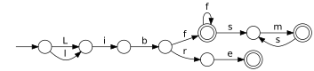

## libfsm and friends: NFA, DFA, regular expressions and lexical analysis

    ; re -cb -pl dot '[Ll]ibf+(sm)*' '[Ll]ibre' | dot

Getting started:

 * See the [tutorial introduction](doc/tutorial/re.md) for a quick overview
   of the re(1) command line interface.
 * [Compilation phases](doc/tutorial/phases.md) for typical applications
   which compile regular expressions to code.

You get:

 * libfsm — library for manipulating FSM (NFA and DFA)
 * libre  — library for compiling regular expressions to NFA
 * fsm(1) — command line interface for FSM
 * re(1)  — command line interface for executing regular expressions
 * lx(1)  — lexer generator

lx is an attempt to produce a simple, expressive, and unobtrusive
lexer generator which is good at lexing, does just lexing,
is language independent, and has no other features.

### Building from source

Clone with submodules (contains required .mk files):

    ; git clone --recursive https://github.com/katef/libfsm.git

To build and install:

    ; bmake -r
    ; bmake -r install

You can override a few things:

    ; CC=clang bmake -r
    ; PREFIX=$HOME bmake -r install

To run the tests:

    ; bmake -r LX=./build/bin/lx test

You need bmake for building. In order of preference:

 1. If you use some kind of BSD (NetBSD, OpenBSD, FreeBSD, ...) this is make(1).
    They all differ slightly. Any of them should work.
 2. If you use Linux or MacOS and you have a package named bmake, use that.
 3. If you use Linux and you have a package named pmake, use that.
    It's the same thing.
    Some package managers have bmake packaged under the name pmake.
    I don't know why they name it pmake.
 4. Otherwise if you use MacOS and you only have a package named bsdmake, use that.
    It's Apple's own fork of bmake.
    It should also work but it's harder for me to test.
 5. If none of these are options for you, you can build bmake from source.
    You don't need mk.tar.gz, just bmake.tar.gz. This will always work.
    https://www.crufty.net/help/sjg/bmake.html

When you see "bmake" in the build instructions above, it means any of these.

To install without building the documentation:

    ; CC=clang PREFIX=$HOME pmake -r -DNODOC install

Building depends on:

 * Any BSD make.
 * A C compiler. Any should do, but GCC and clang are best supported.
 * ar, ld, and a bunch of other stuff you probably already have.
 * xmllint (packaged as libxml2-utils) for `bmake -r test`

Building the documentation depends on:

 * xsltproc(1)
 * Docbook XSLT (and its XML catalog entries, packaged as docbook-xsl and docbook-xml)

Fuzzing depends on the theft property-based testing library:

 * https://github.com/silentbicycle/theft  
   Tests are currently based on the libtheft 0.4.2 API.

Ideas, comments or bugs: kate@elide.org
