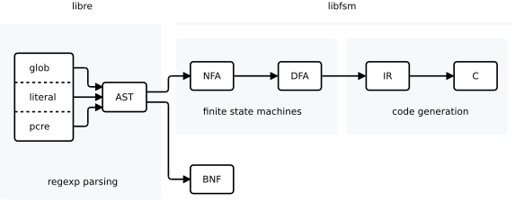
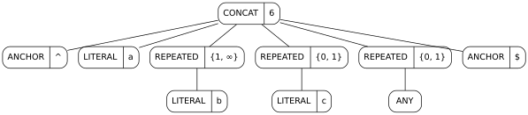
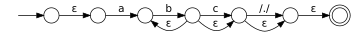
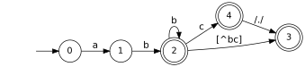
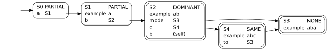

# Compilation phases

Phases for a typical application where regexps are compiled to code:



re(1) commands are given just to show how to see this output by hand;
in a larger program you'd most likely link against libre and libfsm directly
rather than using a command-line interface.

## Parsing

All regexp dialects parse to the same AST (see [re_ast.h](../../src/libre/re_ast.h)):

    ; re -pl ast '^ab+c?.?$' | dot


You can render the AST as an ABNF grammar.
Since regexps describe a *regular* grammar, no recursion is necessary
and there is only ever one production:

    ; re -pl abnf '^ab+c?.?$'
    e = <^> %s"a" %s"b" *( %s"b" ) [ %s"c" ] [ <TODO> ] <$> <$>

Here's the same ABNF represented as a railroad diagram
by [kgt](https://github.com/katef/kgt):


## FSM transformation

The AST can be converted to construct an NFA. This is done by wiring up various
parts of sub-expressions with epsilon transitions to represent repetition,
alternate choices, and so on. These epsilon transitions are traversed "for free",
without consuming a input character.

    ; re -npl dot '^ab+c?.?$' | dot


Various operations can be applied to FSM here;
in particular unioning multiple FSM to give a larger NFA.
This is how libfsm provides for matching a set of multiple regular expressions
with one state machine.

All NFA may be converted to an equivalent DFA; for a given DFA
there is always one canonically minimal form. This can be used to
compare two state machines to find if they match the same languages.

This is the point where the NFA's ambiguities are resolved:
for a DFA, only one input symbol ever needs to be read in order to
decide where to go next from any particular state —
there is never any backtracking.

    ; re -apl dot '^ab+c?.?$' | dot


Here the DFA is drawn showing state numbers; these correspond to the
numbering for nodes in the IR below.
Each node in the IR corresponds to a DFA state.

## Code generation

The generated code is a typical FSM implementation iterating over input
symbols, and switching on which transition to make from each state.
There are a few decisions which can be made when generating code for a state
— for example, if all symbols transition to the same state, there's no need
to switch on the input symbol.

The IR (see [ir.h](../../src/libfsm/print/ir.h)) expresses these different
code generation strategies,
so that this logic is kept out of the code output.
See the strategy types at the top of each node:

    ; re -pl ir '^ab+c?.?$' | dot


For example, S4 has an IR strategy of "SAME",
meaning that all symbols transition to the same state, S3.
You can see this output verbatim to the generated C:

```
        case S4: /* e.g. "abc" */
            state = S3; break;
```

And here's the entire C output:

    ; re -pl c '^ab+c?.?$'
[phase-code.c](phase-code.c)

