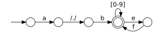
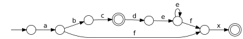
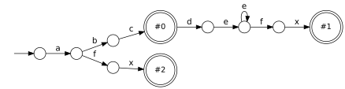
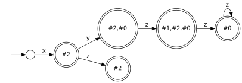
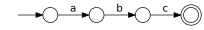
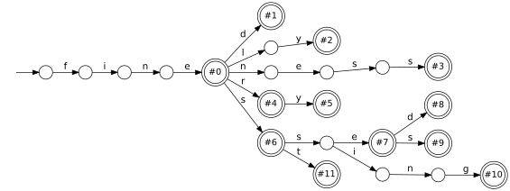

# re(1) introduction and tutorial

You can compile a regular expression to a finite state machine,
and print it to graphviz `.dot` format:
```
; re -pl dot '^a.b([0-9]|ef)*$' | dot
```


In the graphviz output here, `[0-9]` is drawn as a compact notation to represent several edges in parallel.
Likewise `/./` denotes edges for every symbol in parallel.
These conventions are just to save space visually.

Various different regexp dialects are provided, given by the `-r ...` option.
These all construct identical state machines:
```
; re -pl dot -i       '^.*\.jpeg$' # native dialect, the default
; re -pl dot  -r pcre '(?i)^.*\.jpeg$'
; re -pl dot -ir glob '*.jpeg'
; re -pl dot -ir like '%.jpeg' # SQL 'LIKE' syntax
```
The `-i` flag makes a pattern case insensitive, for dialects which do not provide that flag in-line.

## Multiple patterns

Multiple patterns may be unioned together,
as if given as a single regexp in the form `#0|#1|...`:
```
; re -pl dot '^abc$' '^abcde+fx$' '^afx$' | dot
```


Here there's no way to see which regexp was responsible for causing a match,
because they were collapsed together into a minimal state machine.
Giving the `-z` flag labels the accepting states with the index of each regexp responsible
for that particular match, at the cost of being less minimal:
```
; re -zpl dot '^abc$' '^abcde+fx$' '^afx$' | dot
```


Multiple regexps can match the same text.
This is an error by default, but ambiguous matches can be permitted with `-u`:
```
; re  -zpl dot '^xyz*$' '^xyz$' '^xy?z?$' | dot
ambiguous matches for /^xyz*$/, /^xy?z?$/; for example on input 'xy'
; re -uzpl dot '^xyz*$' '^xyz$' '^xy?z?$' | dot
```


## Generating code

There's also a dialect for literal strings:
```
; re -pl dot -r literal abc | dot
```


You can use this to construct a trie:
```
; grep -E '^fine' /usr/share/dict/words \
  | grep -E '^[a-z]+$' \
  | xargs re -zpl dot -r literal \
  | dot
```


And the same thing output to C:
```
; grep -E '^fine' /usr/share/dict/words \
  | grep -E '^[a-z]+$' \
  | xargs re -zpl c -r literal \
  > trie.c
```
[trie.c](trie.c)

Here the accepting states show a bit set for each pattern which matches.
This value is `1 << n` where _n_ is the `#0`, `#1` index we saw for `-z` earlier:
```
    /* end states */
    switch (state) {
    case S4: return 0x1; /* "fine" */
    case S5: return 0x2; /* "fined" */
    case S8: return 0x10; /* "finer" */
    case S9: return 0x40; /* "fines" */
    case S11: return 0x4; /* "finely" */
    case S13: return 0x8; /* "fineness" */
    case S14: return 0x20; /* "finery" */
    case S16: return 0x800; /* "finest" */
    case S17: return 0x80; /* "finesse" */
    case S20: return 0x400; /* "finessing" */
    case S21: return 0x100; /* "finessed" */
    case S22: return 0x200; /* "finesses" */
    default: return -1; /* unexpected EOT */
    }
```
Input is read in one of several ways:
```
while (c = fsm_getc(opaque), c != EOF) { /* -k getc (the default) */
for (p = s; *p != '\0'; p++) {           /* -k str */
for (p = b; *p != e; p++) {              /* -k pair */
```

The re(1) tool is a CLI frontend to libre, which parses regular expressions and constructs
finite state machines using libfsm. libfsm is responsible for NFA to DFA conversion,
and for outputting a state machine as code.
All the operations illustrated here are exposed by [their APIs](../../include).


